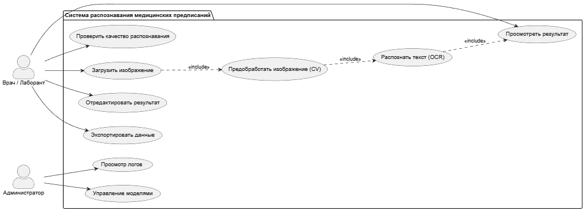
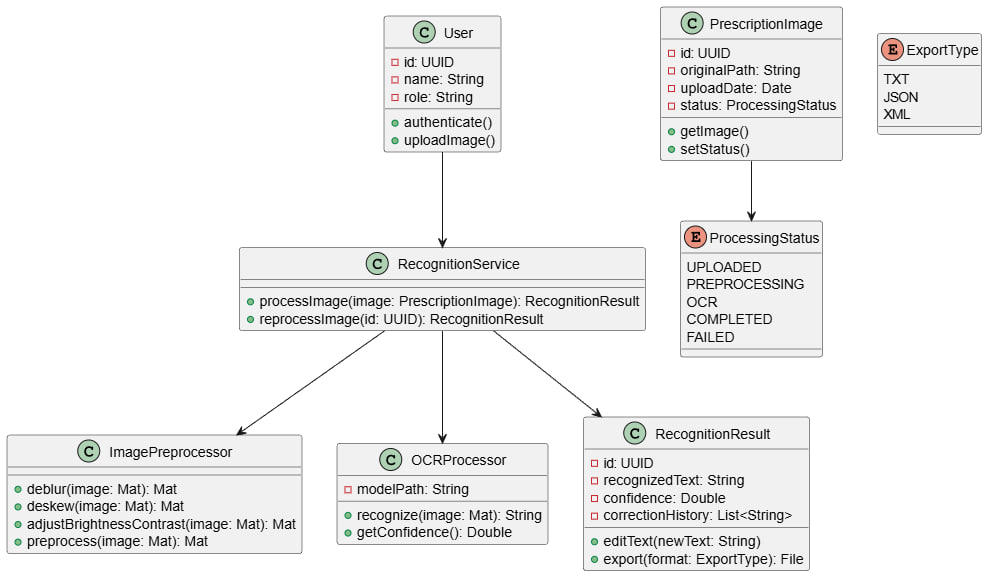
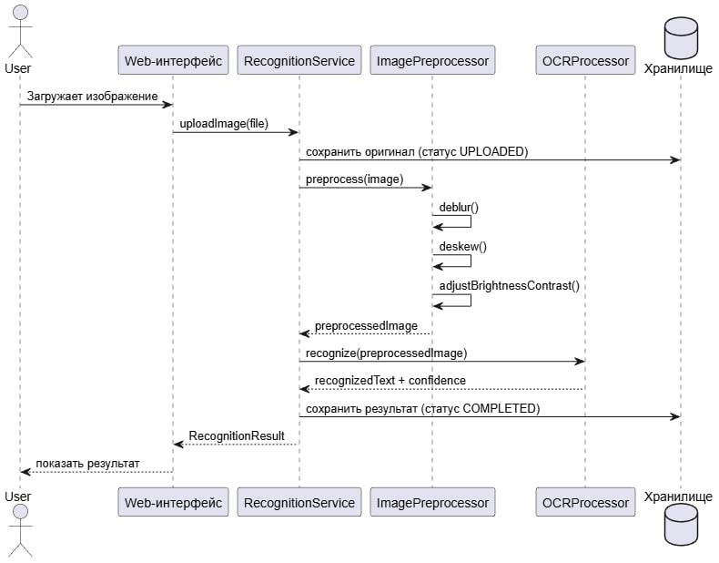
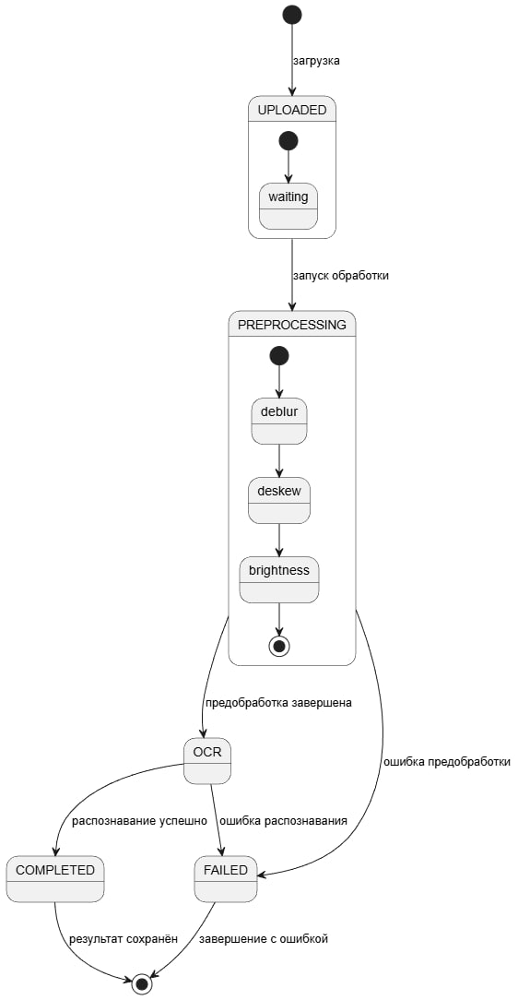
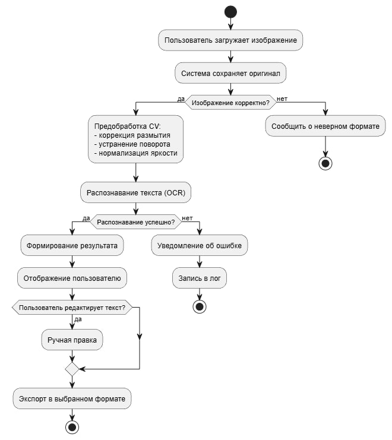
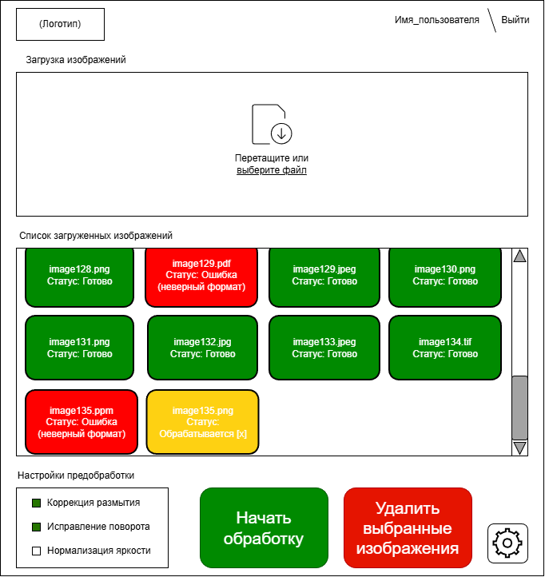

# UML
## Выполнил Магер Е.В. ИВТ 2.2
UML-диаграммы и прототип интерфейса для проекта распознавания медицинских предписаний с предобработкой изображения классическими CV-методами. В репозитории лежат файлы `Use.jpg`, `Class.jpg`, `Sequence.jpg`, `State.jpg`, `Action.jpg` и `UI.png`. :contentReference[oaicite:0]{index=0}

## Диаграммы

### Use Case

### Диаграмма классов

### Диаграмма последовательности

### Диаграмма состояний

### Диаграмма активности

### Прототип интерфейса

## О проекте

Проект описывает систему распознавания медицинских предписаний: загрузка изображения, предобработка, OCR и просмотр результата. :contentReference[oaicite:1]{index=1}
